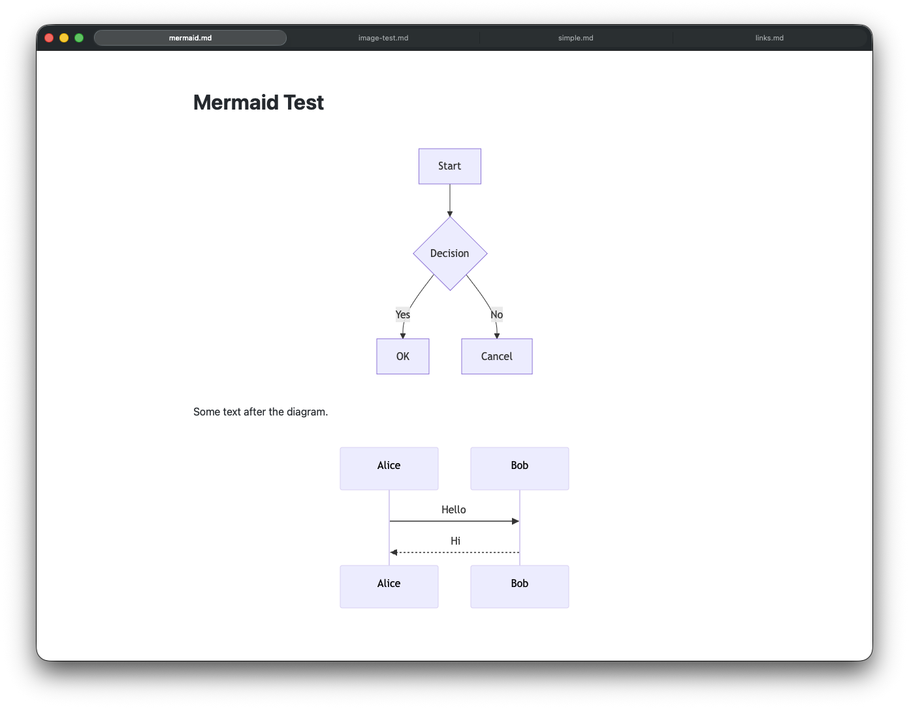

# mdv



A native macOS Markdown viewer launchable from the CLI, with Mermaid diagram rendering support.
Useful as a preview tool for coding agents — add `mdv` to your AGENTS.md to let agents preview Markdown files.

## Features

- Mermaid diagram rendering
- Native macOS tab UI
- Syntax highlighting
- Live reload on file changes

## Installation and Usage

Download the latest dmg from [Releases](https://github.com/negipo/mdv/releases), open it, and drag `mdv.app` to `/Applications`.

On first launch, macOS will block the app because it is not signed. Run the following command before launching:

```bash
xattr -cr /Applications/mdv.app
```

Open mdv.app from Finder to install the CLI command. After that, you can use it from the terminal:

```bash
mdv path/to/file.md
```

## Development

Requires Xcode (including Command Line Tools) and Node.js.

```bash
git clone https://github.com/negipo/mdv.git
cd mdv
npm install
npm run install:local  # Build and install locally
```

```bash
npm run build:js  # Build JS bundle
npm test          # Run tests
npm run lint      # Type check
npm run build     # JS bundle + Xcode build
```

## License

MIT
