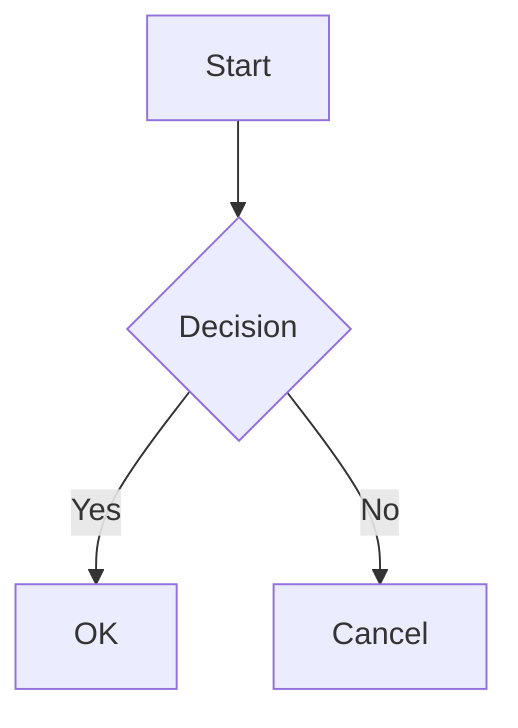
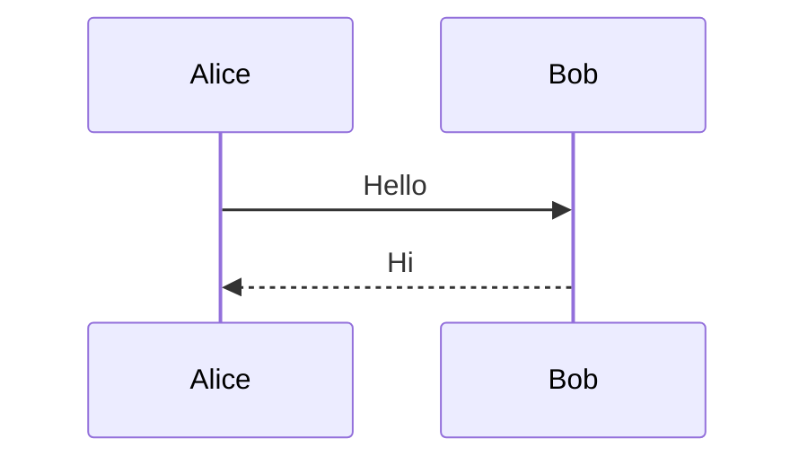

# mdv - Electron Markdown Viewer 実装計画

> **For agentic workers:** REQUIRED SUB-SKILL: Use superpowers:subagent-driven-development (recommended) or superpowers:executing-plans to implement this plan task-by-task. Steps use checkbox (`- [ ]`) syntax for tracking.

**Goal:** CLIから `mdv file.md` で起動でき、Mermaidレンダリングとファイル変更時の自動更新を備えたElectron製Markdownビューアを作成する

**Architecture:** Electronのメインプロセスでファイル読み込みとchokidarによるファイル監視を行い、IPC経由でレンダラープロセスにMarkdownコンテンツを送信する。レンダラープロセスではmarkedでHTML変換し、mermaid.jsでダイアグラムをレンダリングする。electron-builderでmacOS向けスタンドアロンバイナリとしてパッケージングする。

**Tech Stack:** Electron, TypeScript, marked (Markdown→HTML), mermaid.js (レンダラープロセス内), chokidar (ファイル監視), electron-builder (パッケージング)

---

## ファイル構成

```
mdv/
├── package.json
├── tsconfig.json
├── tsconfig.renderer.json    # レンダラープロセス用TypeScript設定
├── src/
│   ├── main.ts               # Electronメインプロセス（ウィンドウ作成、ファイル監視、IPC）
│   ├── preload.ts            # preloadスクリプト（IPC bridge）
│   ├── renderer/
│   │   ├── index.html        # ベースHTML
│   │   ├── renderer.ts       # レンダラープロセス（Markdown変換、mermaid初期化、IPC受信）
│   │   └── style.css         # スタイル
│   └── markdown.ts           # Markdown→HTML変換ロジック（純粋関数、テスト容易）
├── tests/
│   ├── markdown.test.ts      # markdown変換のユニットテスト
│   └── args.test.ts          # 引数パースのユニットテスト
└── fixtures/
    ├── simple.md
    └── mermaid.md
```

---

### Task 1: プロジェクト初期化

**Files:**
- Create: `package.json`
- Create: `tsconfig.json`
- Create: `tsconfig.renderer.json`
- Create: `.gitignore`

- [ ] **Step 1: package.json を作成**

```json
{
  "name": "mdv",
  "version": "0.1.0",
  "description": "CLI Markdown viewer with Mermaid support and live reload",
  "main": "dist/main.js",
  "scripts": {
    "build": "tsc -p tsconfig.json && tsc -p tsconfig.renderer.json",
    "start": "npm run build && electron dist/main.js",
    "dev": "tsc -p tsconfig.json && tsc -p tsconfig.renderer.json && electron dist/main.js",
    "test": "vitest run",
    "test:watch": "vitest",
    "lint": "tsc -p tsconfig.json --noEmit && tsc -p tsconfig.renderer.json --noEmit",
    "pack": "electron-builder --mac"
  },
  "devDependencies": {
    "@types/node": "^22.0.0",
    "electron": "^35.0.0",
    "electron-builder": "^25.0.0",
    "typescript": "^5.7.0",
    "vitest": "^3.0.0"
  },
  "dependencies": {
    "chokidar": "^4.0.0",
    "marked": "^15.0.0",
    "mermaid": "^11.0.0"
  },
  "build": {
    "appId": "com.negipo.mdv",
    "productName": "mdv",
    "mac": {
      "target": "dir"
    },
    "files": [
      "dist/**/*",
      "node_modules/**/*"
    ]
  }
}
```

- [ ] **Step 2: tsconfig.json を作成（メインプロセス用）**

```json
{
  "compilerOptions": {
    "target": "ES2022",
    "module": "commonjs",
    "moduleResolution": "node",
    "outDir": "./dist",
    "rootDir": "./src",
    "strict": true,
    "esModuleInterop": true,
    "declaration": true,
    "sourceMap": true
  },
  "include": ["src/main.ts", "src/preload.ts", "src/markdown.ts"]
}
```

- [ ] **Step 3: tsconfig.renderer.json を作成（レンダラープロセス用）**

```json
{
  "compilerOptions": {
    "target": "ES2022",
    "module": "ES2022",
    "moduleResolution": "bundler",
    "outDir": "./dist/renderer",
    "rootDir": "./src/renderer",
    "strict": true,
    "esModuleInterop": true,
    "sourceMap": true,
    "lib": ["ES2022", "DOM"]
  },
  "include": ["src/renderer/**/*"]
}
```

- [ ] **Step 4: .gitignore を作成**

```
node_modules/
dist/
out/
```

- [ ] **Step 5: 依存関係をインストール**

Run: `npm install`
Expected: node_modules が作成され、package-lock.json が生成される

- [ ] **Step 6: コミット**

```bash
git add package.json tsconfig.json tsconfig.renderer.json .gitignore package-lock.json
git commit -m "chore: initialize Electron project with TypeScript"
```

---

### Task 2: テストフィクスチャの作成

**Files:**
- Create: `fixtures/simple.md`
- Create: `fixtures/mermaid.md`

- [ ] **Step 1: simple.md を作成**

```markdown
# Hello mdv

This is a simple markdown file.

## Features

- Markdown rendering
- Live reload
- Mermaid support

## Code

```js
const x = 1;
```
```

- [ ] **Step 2: mermaid.md を作成**

````markdown
# Mermaid Test



Some text after the diagram.


````

- [ ] **Step 3: コミット**

```bash
git add fixtures/
git commit -m "chore: add test fixtures for markdown and mermaid"
```

---

### Task 3: Markdown変換ロジックの実装 (TDD)

**Files:**
- Create: `src/markdown.ts`
- Create: `tests/markdown.test.ts`

- [ ] **Step 1: テストを書く**

```typescript
// tests/markdown.test.ts
import { describe, it, expect } from "vitest";
import { renderMarkdown } from "../src/markdown";

describe("renderMarkdown", () => {
  it("見出しをHTMLに変換する", () => {
    const result = renderMarkdown("# Hello");
    expect(result).toContain("<h1>Hello</h1>");
  });

  it("コードブロックをHTMLに変換する", () => {
    const result = renderMarkdown("```js\nconst x = 1;\n```");
    expect(result).toContain("<code");
    expect(result).toContain("const x = 1;");
  });

  it("mermaidコードブロックをmermaidクラス付きpre要素に変換する", () => {
    const result = renderMarkdown("```mermaid\ngraph TD\n    A-->B\n```");
    expect(result).toContain('class="mermaid"');
    expect(result).toContain("graph TD");
  });

  it("通常のコードブロックにはmermaidクラスが付かない", () => {
    const result = renderMarkdown("```js\nconst x = 1;\n```");
    expect(result).not.toContain('class="mermaid"');
  });
});
```

- [ ] **Step 2: テストが失敗することを確認**

Run: `npx vitest run tests/markdown.test.ts`
Expected: FAIL（renderMarkdown が存在しない）

- [ ] **Step 3: markdown.ts を実装**

```typescript
// src/markdown.ts
import { Marked, Renderer } from "marked";

const renderer = new Renderer();
const defaultCodeRenderer = renderer.code.bind(renderer);

const marked = new Marked({
  renderer: {
    code(token: { text: string; lang?: string }) {
      if (token.lang === "mermaid") {
        return `<pre class="mermaid">${token.text}</pre>`;
      }
      return defaultCodeRenderer(token);
    },
  },
});

export function renderMarkdown(markdown: string): string {
  return marked.parse(markdown) as string;
}
```

注: marked v15 の API に合わせて調整が必要な場合がある。`Renderer` のインポートパスと `code` メソッドのシグネチャは実際のバージョンを確認すること。

- [ ] **Step 4: テストが通ることを確認**

Run: `npx vitest run tests/markdown.test.ts`
Expected: 4 tests PASS

- [ ] **Step 5: コミット**

```bash
git add src/markdown.ts tests/markdown.test.ts
git commit -m "feat: add markdown renderer with mermaid code block support"
```

---

### Task 4: レンダラープロセスのHTML/CSS/JSの実装

**Files:**
- Create: `src/renderer/index.html`
- Create: `src/renderer/style.css`
- Create: `src/renderer/renderer.ts`

- [ ] **Step 1: index.html を作成**

```html
<!DOCTYPE html>
<html lang="ja">
<head>
  <meta charset="UTF-8">
  <meta name="viewport" content="width=device-width, initial-scale=1.0">
  <meta http-equiv="Content-Security-Policy" content="default-src 'self'; script-src 'self' 'unsafe-inline'; style-src 'self' 'unsafe-inline'">
  <title>mdv</title>
  <link rel="stylesheet" href="style.css">
</head>
<body>
  <div id="content"></div>
  <script src="renderer.js"></script>
</body>
</html>
```

- [ ] **Step 2: style.css を作成**

```css
body {
  max-width: 800px;
  margin: 0 auto;
  padding: 2rem;
  font-family: -apple-system, BlinkMacSystemFont, "Segoe UI", Helvetica, Arial, sans-serif;
  line-height: 1.6;
  color: #24292e;
  background: #fff;
}

pre {
  background: #f6f8fa;
  padding: 1rem;
  border-radius: 6px;
  overflow-x: auto;
}

code {
  background: #f6f8fa;
  padding: 0.2em 0.4em;
  border-radius: 3px;
  font-size: 85%;
}

pre code {
  background: none;
  padding: 0;
}

img {
  max-width: 100%;
}

table {
  border-collapse: collapse;
  width: 100%;
}

th, td {
  border: 1px solid #dfe2e5;
  padding: 6px 13px;
}

blockquote {
  border-left: 4px solid #dfe2e5;
  margin: 0;
  padding: 0 1rem;
  color: #6a737d;
}

pre.mermaid {
  background: none;
  text-align: center;
}
```

- [ ] **Step 3: renderer.ts を作成**

```typescript
// src/renderer/renderer.ts
import mermaid from "mermaid";

mermaid.initialize({ startOnLoad: false, theme: "default" });

const contentEl = document.getElementById("content")!;

async function renderContent(html: string) {
  contentEl.innerHTML = html;

  const mermaidEls = contentEl.querySelectorAll<HTMLElement>("pre.mermaid");
  if (mermaidEls.length > 0) {
    await mermaid.run({ nodes: mermaidEls });
  }
}

(window as any).electronAPI.onMarkdownUpdate((_event: any, html: string) => {
  renderContent(html);
});

(window as any).electronAPI.requestInitialContent();
```

注: レンダラープロセスのビルドについて — `mermaid` パッケージをブラウザ向けにバンドルする必要がある。tscだけでは `import mermaid` を解決できないため、Task 6 でesbuildによるバンドルステップを追加する。この段階ではファイル作成のみ行う。

- [ ] **Step 4: コミット**

```bash
git add src/renderer/
git commit -m "feat: add renderer process HTML, CSS, and script"
```

---

### Task 5: Preloadスクリプトの実装

**Files:**
- Create: `src/preload.ts`

- [ ] **Step 1: preload.ts を作成**

```typescript
// src/preload.ts
import { contextBridge, ipcRenderer } from "electron";

contextBridge.exposeInMainWorld("electronAPI", {
  onMarkdownUpdate: (callback: (event: any, html: string) => void) => {
    ipcRenderer.on("markdown:update", callback);
  },
  requestInitialContent: () => {
    ipcRenderer.send("markdown:request-initial");
  },
});
```

- [ ] **Step 2: ビルドして構文エラーがないことを確認**

Run: `npx tsc -p tsconfig.json --noEmit`
Expected: エラーなし（electron の型が解決できない場合は `@types/electron` は不要、electron パッケージ自体に型定義が含まれる）

- [ ] **Step 3: コミット**

```bash
git add src/preload.ts
git commit -m "feat: add preload script for IPC bridge"
```

---

### Task 6: メインプロセスの実装

**Files:**
- Create: `src/main.ts`

- [ ] **Step 1: main.ts を作成**

```typescript
// src/main.ts
import { app, BrowserWindow, ipcMain } from "electron";
import { watch } from "chokidar";
import { readFileSync } from "node:fs";
import { resolve, join } from "node:path";
import { renderMarkdown } from "./markdown";

let mainWindow: BrowserWindow | null = null;
let currentHtml = "";

function getFilePath(): string {
  const args = process.argv.slice(app.isPackaged ? 1 : 2);
  const filePath = args.find((arg) => !arg.startsWith("-") && !arg.startsWith("--"));
  if (!filePath) {
    console.error("Usage: mdv <file.md>");
    process.exit(1);
  }
  return resolve(filePath);
}

function loadAndRender(filePath: string): string {
  const markdown = readFileSync(filePath, "utf-8");
  return renderMarkdown(markdown);
}

function createWindow() {
  mainWindow = new BrowserWindow({
    width: 900,
    height: 700,
    title: "mdv",
    webPreferences: {
      preload: join(__dirname, "preload.js"),
      contextIsolation: true,
      nodeIntegration: false,
    },
  });

  mainWindow.loadFile(join(__dirname, "renderer", "index.html"));
  mainWindow.on("closed", () => {
    mainWindow = null;
  });
}

app.whenReady().then(() => {
  const filePath = getFilePath();
  currentHtml = loadAndRender(filePath);

  createWindow();

  ipcMain.on("markdown:request-initial", (event) => {
    event.sender.send("markdown:update", currentHtml);
  });

  const watcher = watch(filePath, {
    persistent: true,
    awaitWriteFinish: { stabilityThreshold: 100, pollInterval: 50 },
  });

  watcher.on("change", () => {
    currentHtml = loadAndRender(filePath);
    mainWindow?.webContents.send("markdown:update", currentHtml);
  });

  const basename = filePath.split("/").pop() || "mdv";
  mainWindow!.setTitle(`mdv - ${basename}`);
});

app.on("window-all-closed", () => {
  app.quit();
});
```

- [ ] **Step 2: ビルドして構文エラーがないことを確認**

Run: `npx tsc -p tsconfig.json --noEmit`
Expected: エラーなし

- [ ] **Step 3: コミット**

```bash
git add src/main.ts
git commit -m "feat: add Electron main process with file watching and IPC"
```

---

### Task 7: レンダラーのバンドル設定

**Files:**
- Modify: `package.json`（esbuild依存追加、buildスクリプト修正）

レンダラープロセスで `mermaid` パッケージをimportするため、esbuildでバンドルが必要。

- [ ] **Step 1: esbuild をインストール**

Run: `npm install --save-dev esbuild`
Expected: esbuild が devDependencies に追加される

- [ ] **Step 2: package.json の build スクリプトを更新**

package.json の `scripts.build` を以下に変更:

```json
"build": "tsc -p tsconfig.json && node esbuild.config.mjs",
```

`scripts.dev` も同様に更新:

```json
"dev": "npm run build && electron dist/main.js",
```

`scripts.lint` を更新:

```json
"lint": "tsc -p tsconfig.json --noEmit",
```

tsconfig.renderer.json は esbuild に置き換わるため不要。

- [ ] **Step 3: esbuild.config.mjs を作成**

```javascript
// esbuild.config.mjs
import { build } from "esbuild";
import { cpSync } from "node:fs";

cpSync("src/renderer/index.html", "dist/renderer/index.html");
cpSync("src/renderer/style.css", "dist/renderer/style.css");

await build({
  entryPoints: ["src/renderer/renderer.ts"],
  bundle: true,
  outfile: "dist/renderer/renderer.js",
  platform: "browser",
  format: "iife",
  sourcemap: true,
  target: "es2022",
});
```

- [ ] **Step 4: ビルドが通ることを確認**

Run: `npm run build`
Expected: `dist/` に main.js, preload.js, markdown.js, renderer/index.html, renderer/style.css, renderer/renderer.js が生成される

- [ ] **Step 5: コミット**

```bash
git add package.json esbuild.config.mjs
git commit -m "feat: add esbuild bundling for renderer process"
```

tsconfig.renderer.json が不要になった場合は削除:

```bash
git rm tsconfig.renderer.json
git commit -m "chore: remove unused tsconfig.renderer.json"
```

---

### Task 8: 動作確認

- [ ] **Step 1: テスト用ファイルでElectronを起動**

Run: `npm run dev -- fixtures/mermaid.md`
Expected: Electronウィンドウが開き、Mermaidダイアグラム付きのMarkdownが表示される

注: Electronへの引数渡しがうまくいかない場合は以下で確認:

Run: `npx electron dist/main.js fixtures/mermaid.md`

- [ ] **Step 2: ファイル変更時の自動更新を確認**

別ターミナルで `fixtures/mermaid.md` を編集し、Electronウィンドウ内の表示が自動更新されることを確認する。

- [ ] **Step 3: 全テスト実行**

Run: `npm test`
Expected: ALL PASS

- [ ] **Step 4: 型チェック**

Run: `npm run lint`
Expected: エラーなし

---

### Task 9: CLIラッパースクリプトとパッケージング

**Files:**
- Create: `bin/mdv` (シェルスクリプト)
- Modify: `package.json`（binエントリ追加）

- [ ] **Step 1: bin/mdv シェルスクリプトを作成**

```bash
#!/bin/bash
DIR="$(cd "$(dirname "$0")/.." && pwd)"
exec npx electron "$DIR/dist/main.js" "$@"
```

- [ ] **Step 2: 実行権限を付与**

Run: `chmod +x bin/mdv`

- [ ] **Step 3: package.json に bin エントリを追加**

package.json に以下を追加:

```json
"bin": {
  "mdv": "./bin/mdv"
}
```

- [ ] **Step 4: npm link で動作確認**

Run: `npm link`
Run: `mdv fixtures/simple.md`
Expected: `mdv` コマンドでElectronウィンドウが起動する

- [ ] **Step 5: コミット**

```bash
git add bin/ package.json
git commit -m "feat: add CLI wrapper script for mdv command"
```

---

### Task 10: electron-builder でのパッケージング（任意）

**Files:**
- Modify: `package.json`（build設定の確認）

- [ ] **Step 1: macOS向けビルド**

Run: `npm run pack`
Expected: `out/` または `dist/` 配下にスタンドアロンアプリが生成される

- [ ] **Step 2: パッケージされたアプリでの動作確認**

生成された .app をダブルクリックまたはコマンドラインから起動し、Markdownが正しく表示されることを確認する。

- [ ] **Step 3: コミット（設定変更があった場合のみ）**

```bash
git add -u
git commit -m "chore: configure electron-builder for macOS packaging"
```
