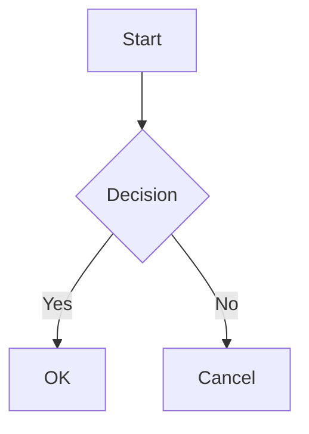
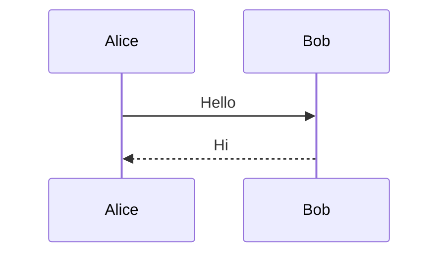

# Comprehensive Markdown Test

## Headings

### H3 Heading

#### H4 Heading

##### H5 Heading

###### H6 Heading

## Paragraphs

This is a paragraph with some text. It has multiple sentences to test line wrapping behavior.

This is a second paragraph separated by a blank line.
This line follows with a single newline (soft break).

## Emphasis

This is **bold text** and this is *italic text*.

This is ***bold and italic*** together.

This is ~~strikethrough~~ text.

## Lists

### Unordered List

- Item 1
- Item 2
  - Nested item 2a
  - Nested item 2b
- Item 3

### Ordered List

1. First item
2. Second item
3. Third item

### Task List

- [x] Completed task
- [ ] Incomplete task
- [ ] Another incomplete task

## Links

### Normal Links

- [Google](https://www.google.com)
- [GitHub](https://github.com)

### Dangerous Links (should be blocked)

- [javascript attack](javascript:alert('XSS'))
- [file protocol](file:///etc/passwd)
- [data protocol](data:text/html,<h1>evil</h1>)

## Images

### Relative Path


## Blockquotes

> This is a blockquote.

> Nested blockquote:
>
> > Inner blockquote

## Code

Inline code: `const x = 1;`

```js
function hello() {
  console.log("Hello, world!");
}
```

```python
def factorial(n):
    return 1 if n <= 1 else n * factorial(n - 1)
```

## Tables

| Feature | Status | Notes |
| ------- | ------ | ----- |
| Mermaid | Done | Diagram rendering |
| KaTeX | Done | Math formula |
| Shiki | Done | Syntax highlight |

## Horizontal Rules

---

## Mermaid Diagrams





## Math

### Inline Math

Euler's identity: $e^{i\pi} + 1 = 0$

The quadratic formula is $x = \frac{-b \pm \sqrt{b^2 - 4ac}}{2a}$ for any $ax^2+bx+c=0$.

### Block Math (Dollar Notation)

$$
\int_0^\infty e^{-x^2} dx = \frac{\sqrt{\pi}}{2}
$$

### Block Math (Code Block)

```math
\sum_{k=1}^{n} k = \frac{n(n+1)}{2}
```

## Raw HTML (Sanitization Test)

<a href="javascript:alert('raw-html-xss')">javascript link in raw HTML</a>


<a href="https://example.com">Normal link in raw HTML</a>
